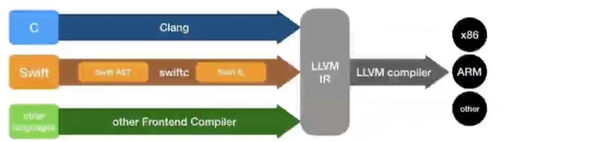
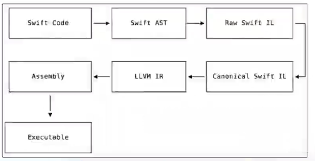

## 一、Swift 版本

### 1. Swift 介绍

* 版本 Swift 5.5

* API（Application Programming Interface）: 应用程序编程接口

  * 源代码和库之间的接口

* ABI（Application Binary Interface）：应用程序二进制接口

  * 应用程序与操作系统之间的底层接口
  * 涉及的内容有：目标文件格式、数据类型的大小\布局\对齐、函数调用约定等等。

* Swift 完全开源：https://github.com/apple/switf , 主要采用 C++ 编写。

### 2. 编译器

#### 1. 前端: 词法分析

#### 2. 后端: 生成对应平台的二进制代码

* 编译步骤
  1. Swift Code （源码）
  2. Swift AST （语法树）
  3. Raw Swift IL （SIL代码）
  4. Canonical Swift IL（优化 SIL 代码）
  5. LLVM IR（生成 IR 代码）
  6. Assembly （汇编）
  7. Executable（生成可执行文件）

> 苹果参考文档: https://swift.org/compiler-stdlib

### 3. Swiftc

​	

* Swiftc 存放在Xcode内部
  * Contents/Developer/Toolchains/XcodeDefault.xctoolchain/usr/bin
* Swiftc 一些操作
  * 生成语法树（AST）：
    * **switc -dump-ast main.swift**
  * 生成最简简洁的 SIL 代码：
    * **swiftc -emit-sil main.swift**
  * 生成LLVM IR代码：
    * **swift 0emit-ir main.swift -o main.ll**
  * 生成汇编代码: 
    * **swiftc -emit-assembly main.swift -o main.s**

### 4. Hello Word

### 5. 常量

### 6. 标识符

### 7. 常见数据类型

### 8. 字面量

### 9. 类型转换

### 10. 元组

